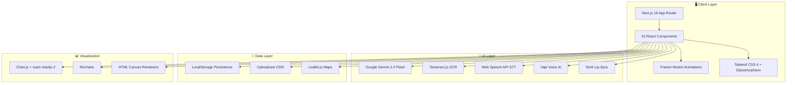

<div align="center">


<br/>

[](https://git.io/typing-svg)

<br/>

<p align="center">
  
  
  
  
  
  
</p>

<p align="center">
  
  
  
  
  
</p>

</div>

---

## 🔥 The Problem We're Solving

> **Indian campuses are drowning in fragmentation.**

Every semester, a college student juggles **15+ different apps** just to survive:

| Pain Point | Current "Solution" | Student Impact |
|---|---|---|
| 📚 Study materials | Random WhatsApp groups | Lost notes, no organization |
| 📊 Attendance tracking | Manual spreadsheets | Missed 75% threshold = debarred |
| 🗓️ Timetable management | Photos of notice boards | Wrong rooms, wasted time |
| 💼 Internship hunting | 6+ job portals | Application fatigue, missed deadlines |
| 🚗 Cab sharing to airport | "Anyone going?" messages | Unsafe, expensive solo rides |
| 🏠 Roommate finding | Word of mouth | Incompatible matches, conflicts |
| 📝 Exam preparation | Scattered PDFs, YouTube | No structure, no feedback |
| 🤖 Career prep | Expensive mock interview apps | ₹500+/session, inaccessible |

**GyanGrow eliminates ALL of this** — one login, one dashboard, 42+ features, zero friction.

---

## 🧭 What is GyanGrow?

<div align="center">

```
┌─────────────────────────────────────────────────────────────────────┐
│                                                                     │
│   GyanGrow is a full-stack Campus Operating System that unifies     │
│   academics, career tools, campus navigation, social connectivity,  │
│   and AI intelligence into a single glassmorphism dashboard.        │
│                                                                     │
│   Think of it as:                                                   │
│   📱 Google Workspace  +  🤖 ChatGPT  +  🗺️ Google Maps  +        │
│   💼 LinkedIn  +  🎮 Duolingo  — all purpose-built for campuses.    │
│                                                                     │
└─────────────────────────────────────────────────────────────────────┘
```

</div>

Built with **Next.js 16**, **React 19**, **Google Gemini AI**, and wrapped in a stunning **glassmorphism dark-mode UI** with **3D card effects**, **ambient particle animations**, and **Framer Motion micro-interactions** — GyanGrow doesn't just work, it *feels* futuristic.

---

## ✨ Complete Feature Ecosystem — 42+ Features

GyanGrow is architecturally divided into **5 interconnected ecosystems**, each comprising deeply integrated, production-grade components. Every feature listed below maps to a real, implemented `.tsx` component.

---

### 🪙 Ecosystem 1: DhanGyan — Gamified Growth Engine

> *Level up your skills while earning campus reputation points.*

| # | Feature | Component | Description |
|---|---|---|---|
| 1 | 🎮 **Mini-Games Arena** | `DhanGyanGames.tsx` | Interactive learning games with score tracking and XP rewards |
| 2 | 📖 **Learning Modules** | `DhanGyanLearning.tsx` | Structured micro-courses across domains — finance, coding, DSA |
| 3 | 🛍️ **Student Marketplace** | `DhanGyanMarketplace.tsx` | Buy/sell/swap notes, gadgets, skills with verified campus peers |
| 4 | 🗺️ **AI Roadmap Generator** | `AiRoadmap.tsx` | Enter any career goal → get a dynamic visual roadmap with YouTube-linked resources and progress checkboxes |
| 5 | 🌍 **Zonal Learning** | `DhanGyanZones.tsx` + `ZonalMap.tsx` | Gamified geographical learning zones with interactive maps |
| 6 | 🧠 **Skills Tracker** | `DhanGyanSkills.tsx` | Track upskilling progress across technologies with visual dashboards |
| 7 | 🏆 **Campus Leaderboard** | `DhanGyanLeaderboard.tsx` | Compete on a live, animated leaderboard — top contributors get badges |
| 8 | 🏛️ **Government Schemes Hub** | `GovSchemes.tsx` | Centralized directory to discover scholarships and government financial schemes |

---

### 🧠 Ecosystem 2: Deep Academics & Study Tools

> *Stop scrambling during exam season. GyanGrow tracks, teaches, and evaluates.*

| # | Feature | Component | Description |
|---|---|---|---|
| 9 | 🤖 **AI Answer Key Evaluator** | `AnswerKeyManager.tsx` | Upload handwritten answer sheets → OCR via `Tesseract.js` + `Gemini AI` grades every answer with mark-by-mark breakdown |
| 10 | 📅 **Smart Timetable** | `TimetableHelper.tsx` | Live class scheduling with room numbers, professor names, and conflict detection |
| 11 | 📊 **Attendance Tracker** | `AttendanceTracker.tsx` | Real-time attendance percentage monitoring with threshold alerts (75% cutoff warnings) |
| 12 | 👓 **AR/VR Immersive Labs** | `ARVRFeatures.tsx` | WebXR environments — Virtual Campus Tours, Interactive Virtual Labs, 3D Engine Assembly, Human Anatomy VR with a dynamic canvas-rendered 3D orb |
| 13 | 📈 **Visual Algorithms** | `VisualAlgorithms.tsx` | Interactive step-by-step visualization of 6 sorting algos (Bubble, Selection, Insertion, Merge, Quick, Heap) + 4 pathfinding algos (Dijkstra, A*, BFS, DFS) with adjustable speed and array size |
| 14 | ⏱️ **Exam Countdown** | `ExamCountdown.tsx` | Live countdown timers for upcoming exams with motivational widgets |
| 15 | 📐 **GPA Calculator** | `GPACalculator.tsx` | Semester-wise CGPA/SGPA computation with grade-point mapping |
| 16 | 📝 **Flashcard Maker** | `FlashcardMaker.tsx` | Create, review, and share spaced-repetition flashcard decks |
| 17 | 📚 **Study Materials** | `StudyMaterials.tsx` | Organized resource library with subject-wise study material access |
| 18 | 🤝 **Study Buddy Finder** | `StudyBuddy.tsx` | Match with peers by subject, study style, and availability |
| 19 | 👥 **Group Study Connect** | `GroupStudy.tsx` | Form and manage study groups with scheduling and topic tracking |
| 20 | 📤 **Note Sharing** | `NoteShare.tsx` | Share and discover peer-uploaded study notes with ratings |

---

### 💼 Ecosystem 3: AI & Career Intelligence

> *Your dedicated suite for landing top-tier placements and building your brand.*

| # | Feature | Component | Description |
|---|---|---|---|
| 21 | 💬 **Mr. Vighelp — AI Chatbot** | `MrVighelp.tsx` | Full-featured AI assistant: **multilingual support** (12+ languages), **Speech-to-Text** via Web Speech API, **file upload analysis** (PDF/images), **PDF export** of entire chat history, context-aware responses powered by Gemini AI |
| 22 | 🎙️ **AI Mock Interviewer** | `AiMockInterview.tsx` | Simulate real technical interviews with: **Vapi voice AI**, **Simli real-time lip-sync avatar**, role/company configuration, live transcript, structured JSON feedback with scores, and a complete interview experience in-browser |
| 23 | 🔍 **Oracle Search** | `OracleSearch.tsx` | Semantic-powered campus and resource search engine |
| 24 | 🚀 **Career Launchpad** | `CareerHub.tsx` | **4-in-1 career suite**: LinkedIn Post Generator (AI-powered with tone/type selection), Resume Builder (4 templates: Modern/Classic/Minimal/Creative + AI ATS scoring + PDF export via `html2canvas` + `jsPDF`), Curated Internship Listings (19+ real companies — Google, Microsoft, Amazon, Goldman Sachs, Outreachy, AICTE, IIT Madras etc.), Hackathon Tracker (10+ live/upcoming hackathons — MLH, Devfolio, SIH, ETHIndia etc.) |

---

### 🏫 Ecosystem 4: Campus Connectivity

> *Navigate massive campuses easily and safely connect with peers.*

| # | Feature | Component | Description |
|---|---|---|---|
| 25 | 🗺️ **Campus Explorer** | `CampusExplorer.tsx` | **Full interactive Leaflet.js satellite map** of VIT Chennai campus with: 14 categorized POIs (Academic/Dining/Sports/Recreation/Library), live event markers with crowd density heatmaps, sports court availability (Available/Engaged status with occupancy counts), nearby destination routing with walk/bike time estimates, search and category filtering |
| 26 | 🎪 **Clubs & Events Central** | `ClubsEvents.tsx` | Unified bulletin for discovering, registering, and tracking hackathons, fests, and club activities |
| 27 | 🏠 **Roommate Finder** | `RoommateMatch.tsx` | Match with compatible hostel roommates filtering by habits, budget, and preferences |
| 28 | 💞 **Partner Match** | `PartnerMatch.tsx` | Find the perfect project partner by tech stack, interests, and availability |
| 29 | 🚗 **Travel Pool** | `TravelPool.tsx` | Campus ride-sharing: post rides or requests across 5 transport modes (Car/Bus/Train/Flight/Auto), popular route presets (VIT ↔ Chennai Airport/Katpadi Junction/Bangalore), rider verification, real-time seat tracking, and in-app cost splitting |
| 30 | 🕵️ **Lost & Found** | `LostAndFound.tsx` | Broadcast and claim missing items across the campus grid |
| 31 | 📊 **Quick Polls** | `QuickPoll.tsx` | Rapid campus sentiment polling with animated result visualization |
| 32 | ⚙️ **Process Hub** | `ProcessGPS.tsx` | Navigate administrative workflows (fee payment, exam registration, hostel allocation) step-by-step |

---

### ⚡ Ecosystem 5: Productivity & Administration

> *Sleek tools designed to eliminate friction and maximize flow state.*

| # | Feature | Component | Description |
|---|---|---|---|
| 33 | 🧘 **Zen Focus Mode** | `FocusMode.tsx` | Customizable distraction-free workspace with ambient soundscapes |
| 34 | 🍅 **Pomodoro Timer** | `PomodoroTimer.tsx` | Classic 25/5 technique with session tracking and break reminders |
| 35 | 📤 **Secure File Share** | `FileShare.tsx` | Uploadcare-powered file transfer with shareable links |
| 36 | 💰 **Budget Tracker** | `BudgetTracker.tsx` | Visual expense insights — track mess bills, subscriptions, outings |
| 37 | 📈 **Pulse Analytics** | `PulseDashboard.tsx` | Systemwide campus data visualization and trending metrics |
| 38 | 📰 **Smart Briefing** | `SmartBriefing.tsx` | Personalized daily digest — tech news, campus announcements, upcoming events |
| 39 | ⚙️ **Admin Automation** | `AdminAutomation.tsx` | AI-powered tools for campus administrators — announcement management, club coordination |
| 40 | ✅ **Todo List** | `TodoList.tsx` | Task management with priority levels and completion tracking |
| 41 | 🌦️ **Weather Widget** | `WeatherWidget.tsx` | Real-time campus weather with atmospheric data |
| 42 | 📋 **Dashboard Overview** | `DashboardOverview.tsx` | Central command center: welcome banner with animated 3D stat cards, activity charts, subject performance radar, grade distribution, attendance donut, quick-action grid, calendar, and todo — all with Chart.js + Recharts visualizations and Framer Motion 3D hover effects |

---

## 🏗️ Architecture & Engineering

### System Design



### Component Architecture — 52 Files

```
src/
├── app/
│   ├── layout.tsx              # Root layout with Inter font
│   └── page.tsx                # Main app shell with section routing
│
├── components/                  # 52 production components
│   │
│   ├── 🤖 AI & Intelligence
│   │   ├── MrVighelp.tsx        # 554 LOC — Multilingual AI chatbot (STT + PDF analysis + export)
│   │   ├── AiMockInterview.tsx  # 800+ LOC — Voice interview sim (Vapi + Simli + Gemini)
│   │   ├── AiRoadmap.tsx        # AI career roadmap generator with YouTube links
│   │   ├── AnswerKeyManager.tsx # OCR-powered answer sheet grading
│   │   ├── OracleSearch.tsx     # Semantic search engine
│   │   └── AIAssistant.tsx      # Helper assistant component
│   │
│   ├── 📚 Academics & Learning
│   │   ├── ARVRFeatures.tsx     # WebXR immersive labs with canvas-rendered 3D orb
│   │   ├── VisualAlgorithms.tsx # 800+ LOC — 10 algorithm visualizations
│   │   ├── FlashcardMaker.tsx   # Spaced repetition flashcards
│   │   ├── TimetableHelper.tsx  # Smart timetable management
│   │   ├── AttendanceTracker.tsx# Real-time attendance monitoring
│   │   ├── ExamCountdown.tsx    # Exam countdown timers
│   │   ├── GPACalculator.tsx    # CGPA/SGPA computation
│   │   ├── StudyMaterials.tsx   # Study resource library
│   │   ├── StudyBuddy.tsx       # Study partner matching
│   │   ├── GroupStudy.tsx       # Group study management
│   │   └── NoteShare.tsx        # Note sharing platform
│   │
│   ├── 🪙 DhanGyan Ecosystem
│   │   ├── DhanGyanHome.tsx     # Ecosystem dashboard & entry
│   │   ├── DhanGyanGames.tsx    # Interactive skill games
│   │   ├── DhanGyanLearning.tsx # Structured micro-courses
│   │   ├── DhanGyanZones.tsx    # Gamified learning zones
│   │   ├── DhanGyanSkills.tsx   # Skill progress tracker
│   │   ├── DhanGyanLeaderboard.tsx # Live animated leaderboard
│   │   ├── DhanGyanMarketplace.tsx # Student marketplace
│   │   ├── ZonalMap.tsx         # Interactive zone map
│   │   └── GovSchemes.tsx       # Government schemes directory
│   │
│   ├── 🏫 Campus Utilities
│   │   ├── CampusExplorer.tsx   # 954 LOC — Full Leaflet.js satellite map with heatmaps
│   │   ├── CareerHub.tsx        # 1322 LOC — 4-in-1 career suite (LinkedIn/Resume/Jobs/Hackathons)
│   │   ├── TravelPool.tsx       # 773 LOC — Campus ride-sharing platform
│   │   ├── ClubsEvents.tsx      # Club & event hub
│   │   ├── RoommateMatch.tsx    # Roommate compatibility matching
│   │   ├── PartnerMatch.tsx     # Project partner finder
│   │   ├── LostAndFound.tsx     # Campus lost & found board
│   │   ├── ProcessGPS.tsx       # Administrative workflow navigator
│   │   └── QuickPoll.tsx        # Campus polls
│   │
│   ├── ⚡ Productivity
│   │   ├── DashboardOverview.tsx # 689 LOC — Central command center with Chart.js
│   │   ├── FocusMode.tsx        # Zen distraction-free mode
│   │   ├── PomodoroTimer.tsx    # Pomodoro technique timer
│   │   ├── FileShare.tsx        # Uploadcare file transfer
│   │   ├── BudgetTracker.tsx    # Expense tracking
│   │   ├── PulseDashboard.tsx   # Campus analytics
│   │   ├── SmartBriefing.tsx    # Daily personalized digest
│   │   ├── AdminAutomation.tsx  # AI admin tools
│   │   ├── TodoList.tsx         # Task management
│   │   └── WeatherWidget.tsx    # Campus weather
│   │
│   ├── 🎨 Core UI
│   │   ├── Sidebar.tsx          # 41-item navigation with glassmorphism
│   │   ├── BootScreen.tsx       # Animated loading screen
│   │   ├── SearchBar.tsx        # Global search input
│   │   ├── KnowledgeCard.tsx    # Reusable information cards
│   │   └── Calendar.tsx         # Interactive calendar widget
│   │
│   └── 📊 Data
│       └── mockData.ts          # Centralized mock data layer
│
├── data/
│   └── mockData.ts              # User, course, and campus data
│
└── styles/
    └── globals.css              # Glassmorphism design system
```

---

## 🛠️ The Tech Stack

<div align="center">

| Layer | Technology | Purpose |
|---|---|---|
| **Framework** | Next.js 16 (App Router) | Server-side rendering, routing |
| **UI Runtime** | React 19 + TypeScript 5 | Component architecture, type safety |
| **Styling** | Tailwind CSS 4 + Framer Motion | Glassmorphism design system, 60fps animations |
| **AI Brain** | Google Gemini 2.0 Flash | Chat, grading, resume scoring, interview feedback |
| **Voice AI** | Vapi + Web Speech API | Voice interviews, speech-to-text dictation |
| **Avatar** | Simli Client | Real-time lip-sync AI interview avatar |
| **OCR** | Tesseract.js | Handwritten answer sheet recognition |
| **Maps** | Leaflet.js + Esri Satellite Tiles | Interactive campus navigation with heatmaps |
| **Charts** | Chart.js + Recharts + react-chartjs-2 | Dashboard analytics, grade distribution |
| **PDF** | jsPDF + html2canvas | Resume export, chat history download |
| **Storage** | Uploadcare CDN | Secure file sharing with link generation |
| **Icons** | Lucide React | 100+ consistent SVG icons throughout |
| **Font** | Inter (Google Fonts) | Clean, modern typography |

</div>

---

## 🎨 Design Philosophy

GyanGrow's UI is built on a **dark glassmorphism design system** that prioritizes:

- 🖤 **Deep Dark Theme** — `bg-[#0a0a14]` base with `rgba(255,255,255,0.02-0.08)` glass layers
- 🌈 **Gradient Accents** — Cyan-to-violet gradients for CTAs, amber for warnings, emerald for success
- 🪞 **Frosted Glass Effects** — `backdrop-blur-xl` + `border border-white/[0.05]` on every panel
- 🎭 **3D Card Interactions** — `perspective(1000px) rotateX/Y` transforms on dashboard stat cards
- ✨ **Micro-Animations** — Framer Motion `whileHover`, `whileTap`, staggered reveals, layout animations
- 📐 **Responsive Design** — Mobile-first with `sm:`, `md:`, `lg:` breakpoints throughout
- 🎯 **Semantic Navigation** — 41-item animated sidebar with collapsible categories

---

## 🚀 Getting Started

### Prerequisites

| Requirement | Version |
|---|---|
| Node.js | ≥ 18.0 |
| npm / pnpm | Latest |
| Gemini API Key | [Get one free](https://aistudio.google.com/apikey) |
| Uploadcare Key | [Sign up](https://uploadcare.com/) |

### Quick Start

```bash
# 1. Clone the repository
git clone https://github.com/Shivam2005Goel/GyanGrow.git
cd GyanGrow

# 2. Install dependencies
npm install

# 3. Configure environment
cp .env.example .env.local
```

Edit `.env.local` with your API keys:

```env
NEXT_PUBLIC_GEMINI_API_KEY=your_gemini_key
NEXT_PUBLIC_UPLOADCARE_PUBLIC_KEY=your_uploadcare_key

# Optional — for AI Mock Interview features
NEXT_PUBLIC_VAPI_PUBLIC_KEY=your_vapi_key
NEXT_PUBLIC_SIMLI_API_KEY=your_simli_key
NEXT_PUBLIC_SIMLI_FACE_ID=your_face_id
```

```bash
# 4. Launch development server
npm run dev
```

Open **<http://localhost:3000>** — you'll be greeted by the animated boot screen, then the full GyanGrow dashboard.

---

## 📊 Impact & Scale

<div align="center">

| Metric | Value |
|---|---|
| **Components Built** | 52 production `.tsx` files |
| **Features Shipped** | 42+ integrated utilities |
| **Lines of Code** | ~30,000+ |
| **AI Integrations** | 5 (Gemini, Vapi, Simli, Tesseract, Web Speech) |
| **Map POIs** | 14 campus locations + 8 live events |
| **Resume Templates** | 4 (Modern, Classic, Minimal, Creative) |
| **Algorithm Visualizations** | 10 (6 sorting + 4 pathfinding) |
| **Internship Listings** | 19 real companies with live links |
| **Hackathon Listings** | 10 active hackathons with live links |
| **Transport Modes** | 5 (Car, Bus, Train, Flight, Auto) |
| **AR/VR Experiences** | 4 (Campus Tour, Virtual Labs, 3D Engine, Anatomy VR) |
| **Supported Languages** | 12+ for AI Chat (Mr. Vighelp) |

</div>

---

## 🏆 What Makes GyanGrow Hackathon-Winning?

| Criteria | How GyanGrow Excels |
|---|---|
| **Problem Significance** | Addresses fragmentation across 40K+ Indian colleges affecting 20M+ students |
| **Solution Depth** | Not a prototype — 52 production components, each with full UI polish |
| **Technical Complexity** | Integrates 5 AI APIs, real-time maps, OCR, voice synthesis, lip-sync avatars |
| **Innovation** | First platform combining AR/VR labs + AI interviews + campus heatmaps + gamified learning in one dashboard |
| **User Experience** | Every screen uses glassmorphism, 3D interactions, and micro-animations — zero generic Bootstrap |
| **Scalability** | Component-driven architecture — any campus can adopt by swapping mock data |
| **Completeness** | 42 features shipped, not 5 screens with "coming soon" labels |

---

## 🤝 Contributing

GyanGrow thrives on community contributions. Here's how to jump in:

1. **Fork** the repo and explore `src/components/`
2. **Pick an issue** — check `good first issue` tags or propose a new feature
3. **Build your component** following the glassmorphism design system:
   - Dark background: `bg-white/[0.02]`
   - Glass borders: `border border-white/[0.05]`
   - Frosted glass: `backdrop-blur-xl`
   - Animations: Framer Motion `motion.div`
4. **Register it** in `Sidebar.tsx` nav items
5. **Submit a PR** — we review within 24 hours

---

## 📜 License

This project is licensed under the MIT License — see the [LICENSE](LICENSE) file for details.

---

<div align="center">


### 🌟 *One platform. Every campus need. Zero friction.*

<br/>

**GyanGrow — Redefining the Indian College Digital Experience**

<br/>

[](https://github.com/Shivam2005Goel/GyanGrow/stargazers)
[](https://github.com/Shivam2005Goel/GyanGrow/network)

<br/>


<br/><br/>

*Built with 💜 for Indian campus students*

</div>
